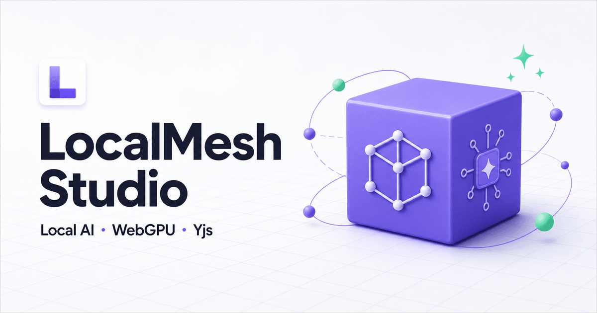
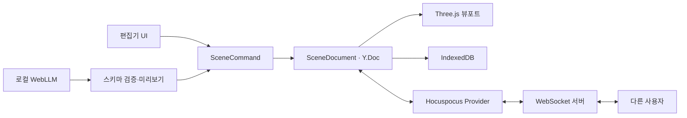

# LocalMesh Studio

> React·TypeScript로 구현한 실험형 3D Studio 사이드 프로젝트입니다. 브라우저에서 3D 장면과 로컬 LLM 명령을 다루고, 로컬 개발 환경에서는 Yjs·Hocuspocus 기반 동기화 흐름을 확인할 수 있습니다.

<p align="center">
  
</p>

<p align="center">
  TypeScript · React · Three.js · WebGPU · WebLLM · Yjs · Hocuspocus · IndexedDB
</p>

<p align="center">
  <a href="https://localmesh-studio.okorion.chatgpt.site"><strong>공개 데모 열기</strong></a>
</p>

> [!NOTE]
> 공개 데모는 Yjs 문서를 브라우저의 IndexedDB에 저장하는 로컬 모드입니다. 다중 사용자 동기화는 로컬 Hocuspocus 서버를 함께 실행했을 때 확인할 수 있으며, 현재 서버는 인증·룸 접근 제어·서버 영속 저장을 갖춘 운영 구성이 아닙니다.

## 제품 개요

LocalMesh Studio는 3D 편집, AI 명령, 로컬 저장, 실시간 협업 실험이 서로 다른 데이터 모델을 만들지 않도록 설계했습니다. 사용자의 UI 입력과 로컬 AI 출력은 모두 `SceneCommand`로 정규화되고, `SceneDocument`가 단일 Yjs 문서에 적용합니다. Three.js 뷰포트와 로컬 Hocuspocus 서버의 같은 룸에 연결된 클라이언트가 같은 문서의 변경을 구독합니다.

현재 버전은 Cube, Sphere, Cylinder 생성, 뷰포트 선택·강조, 이동·회전·크기 기즈모, 이름·색상·Transform 편집, 오브젝트 복사·붙여넣기, 기본 키보드 단축키, CSG 합집합·차집합·교집합, 실행 취소·다시 실행, LocalMesh JSON v2 내보내기를 지원합니다.

## 핵심 기능

| 기능 | 설명 |
| --- | --- |
| 3D 장면 편집 | Three.js `WebGPURenderer`를 우선 사용하고 미지원 환경에서는 WebGL로 전환합니다. |
| 선택과 트랜스폼 | 뷰포트 또는 장면 목록에서 오브젝트를 선택하면 외곽선과 기즈모를 표시하고, 이동·회전·크기 변경을 한 번의 편집 명령으로 기록합니다. |
| 키보드 워크플로 | W/E/R 모드 전환, Esc 선택 해제, Delete/Backspace 삭제, Ctrl/⌘ 기반 복사·붙여넣기와 실행 취소·다시 실행을 지원합니다. |
| CSG 모델링 | 현재 선택을 A로 두고 CSG 패널에서 B를 명시적으로 선택해 합집합(A ∪ B), 차집합(A − B), 교집합(A ∩ B)을 계산합니다. 성공하면 두 입력을 편집 가능한 하나의 custom mesh로 원자적으로 교체합니다. |
| 축별 협업 병합 | 위치·회전·크기의 변경된 축만 독립 Yjs 키로 기록해, 서로 다른 축의 동시 편집과 선택적 Undo/Redo를 보존합니다. |
| 로컬 AI 명령 | WebLLM의 `Qwen3-0.6B` 모델이 Web Worker에서 실행됩니다. 프롬프트와 장면 문맥을 외부 AI API로 보내지 않습니다. |
| 안전한 AI 적용 | 모델 응답을 Zod 스키마로 검증하고, 장면 명령 미리보기를 사용자가 승인한 뒤 적용합니다. |
| 로컬 우선 저장 | `y-indexeddb`가 브라우저에 Yjs 문서를 저장하므로 새로고침하거나 다시 열어도 장면을 복구합니다. |
| 실시간 협업 실험 | 로컬 개발 환경에서 Hocuspocus Provider와 별도 WebSocket 서버가 같은 Yjs 문서를 클라이언트 사이에 전달합니다. |
| 공급자 확장 | `SceneAiProvider` 경계를 통해 로컬 모델을 기본으로 유지하면서 외부 API 공급자를 추가할 수 있습니다. |

## 동작 구조



Yjs는 충돌 없는 공유 문서와 병합 규칙을 제공합니다. 실제 소켓 연결은 Yjs 내부 기능이 아니라 `@hocuspocus/provider`와 별도 Hocuspocus 서버가 담당합니다.

## 공개 데모

[https://localmesh-studio.okorion.chatgpt.site](https://localmesh-studio.okorion.chatgpt.site)

공개 버전은 별도 협업 소켓을 연결하지 않은 로컬 저장 모드입니다. 방문자의 장면과 로컬 AI 프롬프트는 각 브라우저 안에서 처리됩니다.

## 빠른 시작

### 요구 사항

- Node.js 22.13 이상
- 최신 Chromium 계열 브라우저 권장
- 로컬 AI 사용 시 WebGPU를 지원하는 브라우저와 GPU

### 실행

```bash
npm install
npm run dev
```

`npm run dev`는 웹 편집기와 로컬 협업 서버를 함께 실행합니다.

- 웹 편집기: 기본 `http://localhost:3000`
- 협업 WebSocket: `ws://localhost:1234`

다른 소켓 서버를 사용할 때는 `.env.example`을 참고해 `NEXT_PUBLIC_COLLABORATION_URL`을 설정합니다.

## 사용 흐름

1. 왼쪽 패널에서 Cube, Sphere, Cylinder를 추가합니다.
2. 뷰포트 또는 장면 목록에서 오브젝트를 선택합니다.
3. 상단 복사·붙여넣기 버튼이나 `Ctrl/⌘+C`, `Ctrl/⌘+V`로 선택한 오브젝트를 복제할 수 있습니다.
4. 뷰포트의 기즈모 또는 오른쪽 Inspector에서 위치, 회전, 크기를 조정합니다.
5. CSG가 필요하면 보라색으로 강조된 현재 선택을 A로 유지하고 CSG 패널의 목록에서 다른 오브젝트 B를 명시적으로 고릅니다. B는 뷰포트에서 amber 색상으로 함께 강조됩니다.
6. 다른 실시간 협업자가 연결되지 않은 상태에서 `합집합 A ∪ B`, `차집합 A − B`, `교집합 A ∩ B` 중 하나를 실행합니다. 성공한 결과는 두 원본을 대체하는 custom mesh가 되어 A로 선택되며, 한 번의 Undo/Redo로 두 원본과 결과를 전환할 수 있습니다.
7. 하단 AI 입력창에 `보라색 구를 오른쪽에 추가해줘`와 같은 명령을 입력하고, 생성된 명령을 확인한 뒤 승인합니다.
8. 필요한 경우 LocalMesh JSON v2로 장면을 내보냅니다.

CSG 결과가 비어 있거나 계산·topology 검증에 실패하거나 계산 중 A/B가 변경되면 장면을 변경하지 않고 두 원본을 그대로 보존합니다. 성공한 custom mesh는 일반 오브젝트처럼 이동·회전·크기 조절할 수 있고, 다른 CSG 연산의 A 또는 B로 다시 사용할 수 있습니다. 입력 검증을 통과한 첫 실행에서만 `three-bvh-csg`를 지연 로드합니다. 프리미티브 입력은 position welding 뒤 퇴화 삼각형·열린 edge·비영 부피 검사를 통과한 닫힌 two-manifold여야 합니다. 앱이 bake한 CSG mesh와 엔진 출력에는 `csg-engine-output-v1` topology 표식을 요구하고, 최소 면 수·유효 면적·bbox 중심 signed volume을 확인한 뒤 미세한 seam·T-junction을 tolerance 기반으로 정규화합니다. 가장 긴 열린 edge 또는 연결된 열린 경계의 span이 bounding-box 최대 변의 75%를 넘거나 체적이 없으면 거부합니다. 입력과 출력은 각각 20,000개 삼각형을 넘으면 적용하지 않습니다.

> [!IMPORTANT]
> `three-bvh-csg`는 실험 단계의 라이브러리입니다. topology 검증을 통과해도 자기 교차·수치 정밀도 코너 케이스까지 CAD 수준으로 보장하지 않습니다. LocalMesh는 다른 실시간 협업자가 연결된 동안 CSG 실행을 막고 계산 직후 대기 중인 문서 업데이트를 처리한 다음 A/B를 재검증합니다. 그래도 아직 수신되지 않은 오프라인 변경과 동시에 실행된 CSG까지 합의하지는 못하므로, 병합 뒤 중복 결과나 한쪽 Undo 뒤 원본과 상대 결과가 함께 남을 수 있습니다. 중요한 모델은 내보낸 파일을 별도로 검수하세요.

CSG custom mesh를 공유하는 협업 클라이언트는 모두 LocalMesh JSON v2 스키마를 지원하는 동일 버전을 사용해야 합니다. 구 v1 클라이언트는 `kind: "mesh"`를 표시하지 못합니다.

첫 AI 실행에서는 모델 파일을 내려받아 브라우저에 캐시하므로 네트워크와 기기 성능에 따라 시간이 걸릴 수 있습니다.

### 기본 단축키

| 키 | 동작 |
| --- | --- |
| `W` / `E` / `R` | 뷰포트 또는 트랜스폼 도구에 포커스가 있을 때 이동 / 회전 / 크기 모드 |
| `Esc` | 선택 해제 |
| `Delete` / `Backspace` | 선택한 오브젝트 삭제 |
| `Ctrl` 또는 `⌘` + `C` | 선택한 오브젝트 복사 |
| `Ctrl` 또는 `⌘` + `V` | 복사한 오브젝트 붙여넣기 |
| `Ctrl` 또는 `⌘` + `Z` | 실행 취소 |
| `Ctrl` 또는 `⌘` + `Shift` + `Z` | 다시 실행 |
| `Ctrl` 또는 `⌘` + `Y` | 다시 실행 |

복사한 오브젝트는 현재 탭의 LocalMesh 내부 클립보드에만 보관됩니다. 새로고침하거나 다른 탭·앱으로 이동하면 이어서 붙여넣을 수 없습니다. W/E/R은 뷰포트와 트랜스폼 도구에 포커스가 있을 때만 동작합니다. 텍스트 입력, 숫자 입력, 선택 상자, 편집 가능한 영역에 포커스가 있을 때는 전역 단축키를 가로채지 않으므로 시스템 복사·붙여넣기를 그대로 사용할 수 있습니다.

### LocalMesh JSON v2

내보내기 루트는 `{ "format": "localmesh.scene", "version": 2, "objects": [...] }`입니다. 프리미티브는 kind와 Transform을 유지하고, `kind: "mesh"`인 baked custom mesh는 다시 렌더링하고 CSG 입력으로 사용할 수 있도록 로컬 좌표계의 `geometry.positions`, `geometry.normals`, `geometry.operation`, `geometry.topology`를 함께 저장합니다. positions와 normals는 유한한 숫자로 구성된 같은 길이의 배열이며, non-indexed 삼각형 단위이므로 길이가 9의 배수이고 각각 최대 180,000개 scalar입니다. operation은 `union`, `subtract`, `intersect` 중 하나이고 topology는 현재 `csg-engine-output-v1`입니다. v2는 이 custom geometry를 보존하기 위한 형식이며 glTF/GLB와의 호환 형식은 아닙니다.

## 수정 위치 안내

| 변경하려는 것 | 고칠 위치 |
| --- | --- |
| 페이지 조립과 메타데이터 | `app/` |
| 편집기 화면과 사용자 입력 | `components/editor/` |
| 장면 스키마와 명령 | `features/scene/` |
| 로컬 저장과 WebSocket 연결 | `features/collaboration/` |
| 로컬 LLM과 AI 명령 변환 | `features/ai/` |
| Hocuspocus 소켓 서버 | `services/collaboration-server/` |
| Sites 배포 어댑터 | `worker/`, `build/`, `.openai/` |

장면을 변경하는 모든 경로는 `SceneCommand`를 거칩니다. 새 기능을 추가할 때 UI, AI, 협업 경로마다 별도 편집 로직을 만들지 않는 것이 핵심 유지보수 원칙입니다.

## 프로젝트 구조

```text
app/                          페이지, 전역 스타일, 메타데이터
components/editor/            편집기 패널과 Three.js 뷰포트
features/scene/               장면 스키마, 명령, Yjs 문서
features/scene/csg.ts         CSG 검증, 지연 로드, geometry baking
features/scene/geometry.ts    프리미티브·custom mesh geometry 생성
features/ai/                  WebLLM 공급자, Worker, 응답 검증
features/collaboration/       IndexedDB와 Hocuspocus 연결
services/collaboration-server/ 로컬 WebSocket 서버
worker/                       Sites 런타임 진입점
docs/                         아키텍처와 결정 기록
```

## 검증 명령

```bash
npm run typecheck
npm run lint
npm run test
npm run build
# 또는 전체 검증
npm run check
```

## 공개 배포 시 주의 사항

- Sites 배포는 소켓 주소가 없으면 로컬 저장 모드로 동작합니다.
- 실시간 협업을 공개 서비스에 활성화하려면 인증, 사용자별 Room ID, 영속 저장소를 갖춘 별도 WebSocket 서버가 필요합니다.
- 현재 `services/collaboration-server`는 로컬 개발용 메모리 서버이며, 그대로 인터넷에 노출하는 운영 구성이 아닙니다.
- 외부 AI API를 추가하면 키를 브라우저 코드에 넣지 말고 서버 측에서 보호해야 합니다.

## 현재 범위와 다음 단계

- 현재 오브젝트: Box, Sphere, Cylinder, CSG로 생성한 baked custom mesh
- 현재 CSG: 단독 실시간 연결 상태의 합집합, A − B 차집합, 교집합. AI 명령을 통한 CSG는 범위 밖
- 현재 교환 형식: custom geometry의 positions/normals/operation/topology를 포함하는 LocalMesh JSON v2 내보내기
- 다음 후보: glTF/GLB 가져오기·내보내기
- 다음 후보: 인증된 협업 Room과 서버 영속 저장
- 다음 후보: 로컬 모델과 외부 API 공급자 선택 UI

더 자세한 구조는 [`docs/architecture.md`](docs/architecture.md), 제품 결정 기록은 [`docs/decisions.md`](docs/decisions.md)를 참고하세요.

## 라이선스

이 저장소에는 아직 별도 오픈소스 라이선스가 지정되지 않았습니다.
