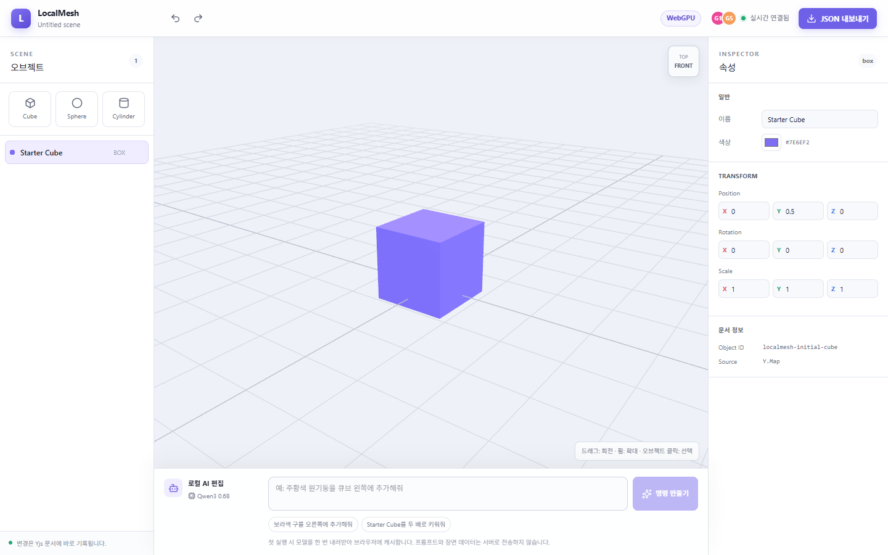
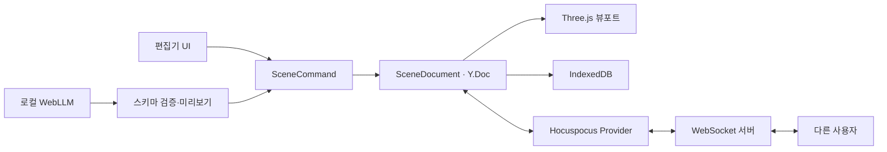

# LocalMesh Studio

> React·TypeScript로 구현한 실험형 3D Studio 사이드 프로젝트입니다. 브라우저에서 3D 장면과 로컬 LLM 명령을 다루고, 로컬 개발 환경에서는 Yjs·Hocuspocus 기반 동기화 흐름을 확인할 수 있습니다.

<p align="center">
  
</p>

<p align="center">
  TypeScript · React · Three.js · WebGPU · WebLLM · Yjs · Hocuspocus · IndexedDB
</p>

<p align="center">
  <a href="https://localmesh-studio.okorion.chatgpt.site"><strong>공개 데모 열기</strong></a>
</p>



> [!NOTE]
> 공개 데모는 Yjs 문서를 브라우저의 IndexedDB에 저장하는 로컬 모드입니다. 다중 사용자 동기화는 로컬 Hocuspocus 서버를 함께 실행했을 때 확인할 수 있으며, 현재 서버는 인증·룸 접근 제어·서버 영속 저장을 갖춘 운영 구성이 아닙니다.

## 제품 개요

LocalMesh Studio는 3D 편집, AI 명령, 로컬 저장, 실시간 협업 실험이 서로 다른 데이터 모델을 만들지 않도록 설계했습니다. 사용자의 UI 입력과 로컬 AI 출력은 모두 `SceneCommand`로 정규화되고, `SceneDocument`가 단일 Yjs 문서에 적용합니다. Three.js 뷰포트와 로컬 Hocuspocus 서버의 같은 룸에 연결된 클라이언트가 같은 문서의 변경을 구독합니다.

현재 버전은 Cube, Sphere, Cylinder 생성과 이름·색상·Transform 편집, 실행 취소·다시 실행, JSON 내보내기를 지원합니다.

## 핵심 기능

| 기능 | 설명 |
| --- | --- |
| 3D 장면 편집 | Three.js `WebGPURenderer`를 우선 사용하고 미지원 환경에서는 WebGL로 전환합니다. |
| 로컬 AI 명령 | WebLLM의 `Qwen3-0.6B` 모델이 Web Worker에서 실행됩니다. 프롬프트와 장면 문맥을 외부 AI API로 보내지 않습니다. |
| 안전한 AI 적용 | 모델 응답을 Zod 스키마로 검증하고, 장면 명령 미리보기를 사용자가 승인한 뒤 적용합니다. |
| 로컬 우선 저장 | `y-indexeddb`가 브라우저에 Yjs 문서를 저장하므로 새로고침하거나 다시 열어도 장면을 복구합니다. |
| 실시간 협업 실험 | 로컬 개발 환경에서 Hocuspocus Provider와 별도 WebSocket 서버가 같은 Yjs 문서를 클라이언트 사이에 전달합니다. |
| 공급자 확장 | `SceneAiProvider` 경계를 통해 로컬 모델을 기본으로 유지하면서 외부 API 공급자를 추가할 수 있습니다. |

## 동작 구조



Yjs는 충돌 없는 공유 문서와 병합 규칙을 제공합니다. 실제 소켓 연결은 Yjs 내부 기능이 아니라 `@hocuspocus/provider`와 별도 Hocuspocus 서버가 담당합니다.

## 공개 데모

[https://localmesh-studio.okorion.chatgpt.site](https://localmesh-studio.okorion.chatgpt.site)

공개 버전은 별도 협업 소켓을 연결하지 않은 로컬 저장 모드입니다. 방문자의 장면과 로컬 AI 프롬프트는 각 브라우저 안에서 처리됩니다.

## 빠른 시작

### 요구 사항

- Node.js 22.13 이상
- 최신 Chromium 계열 브라우저 권장
- 로컬 AI 사용 시 WebGPU를 지원하는 브라우저와 GPU

### 실행

```bash
npm install
npm run dev
```

`npm run dev`는 웹 편집기와 로컬 협업 서버를 함께 실행합니다.

- 웹 편집기: 기본 `http://localhost:3000`
- 협업 WebSocket: `ws://localhost:1234`

다른 소켓 서버를 사용할 때는 `.env.example`을 참고해 `NEXT_PUBLIC_COLLABORATION_URL`을 설정합니다.

## 사용 흐름

1. 왼쪽 패널에서 Cube, Sphere, Cylinder를 추가합니다.
2. 뷰포트 또는 장면 목록에서 오브젝트를 선택합니다.
3. 오른쪽 Inspector에서 이름, 색상, 위치, 회전, 크기를 조정합니다.
4. 하단 AI 입력창에 `보라색 구를 오른쪽에 추가해줘`와 같은 명령을 입력합니다.
5. 생성된 명령을 확인하고 승인하여 장면에 적용합니다.
6. 필요한 경우 JSON으로 장면을 내보냅니다.

첫 AI 실행에서는 모델 파일을 내려받아 브라우저에 캐시하므로 네트워크와 기기 성능에 따라 시간이 걸릴 수 있습니다.

## 수정 위치 안내

| 변경하려는 것 | 고칠 위치 |
| --- | --- |
| 페이지 조립과 메타데이터 | `app/` |
| 편집기 화면과 사용자 입력 | `components/editor/` |
| 장면 스키마와 명령 | `features/scene/` |
| 로컬 저장과 WebSocket 연결 | `features/collaboration/` |
| 로컬 LLM과 AI 명령 변환 | `features/ai/` |
| Hocuspocus 소켓 서버 | `services/collaboration-server/` |
| Sites 배포 어댑터 | `worker/`, `build/`, `.openai/` |

장면을 변경하는 모든 경로는 `SceneCommand`를 거칩니다. 새 기능을 추가할 때 UI, AI, 협업 경로마다 별도 편집 로직을 만들지 않는 것이 핵심 유지보수 원칙입니다.

## 프로젝트 구조

```text
app/                          페이지, 전역 스타일, 메타데이터
components/editor/            편집기 패널과 Three.js 뷰포트
features/scene/               장면 스키마, 명령, Yjs 문서
features/ai/                  WebLLM 공급자, Worker, 응답 검증
features/collaboration/       IndexedDB와 Hocuspocus 연결
services/collaboration-server/ 로컬 WebSocket 서버
worker/                       Sites 런타임 진입점
docs/                         아키텍처와 결정 기록
```

## 검증 명령

```bash
npm run typecheck
npm run lint
npm run build
# 또는 전체 검증
npm run check
```

## 공개 배포 시 주의 사항

- Sites 배포는 소켓 주소가 없으면 로컬 저장 모드로 동작합니다.
- 실시간 협업을 공개 서비스에 활성화하려면 인증, 사용자별 Room ID, 영속 저장소를 갖춘 별도 WebSocket 서버가 필요합니다.
- 현재 `services/collaboration-server`는 로컬 개발용 메모리 서버이며, 그대로 인터넷에 노출하는 운영 구성이 아닙니다.
- 외부 AI API를 추가하면 키를 브라우저 코드에 넣지 말고 서버 측에서 보호해야 합니다.

## 현재 범위와 다음 단계

- 현재 프리미티브: Box, Sphere, Cylinder
- 현재 교환 형식: LocalMesh JSON 내보내기
- 다음 후보: glTF/GLB 가져오기·내보내기
- 다음 후보: 인증된 협업 Room과 서버 영속 저장
- 다음 후보: 로컬 모델과 외부 API 공급자 선택 UI

더 자세한 구조는 [`docs/architecture.md`](docs/architecture.md), 제품 결정 기록은 [`docs/decisions.md`](docs/decisions.md)를 참고하세요.

## 라이선스

이 저장소에는 아직 별도 오픈소스 라이선스가 지정되지 않았습니다.
